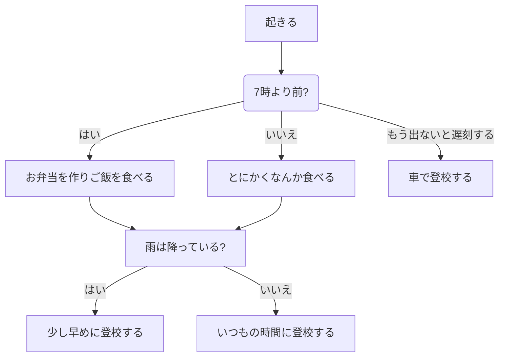

```mermaid
flowchart TD
    A[起きる] --> B(7時より前?)
    B --> |はい| C[お弁当を作りご飯を食べる]
    C[お弁当を作りご飯を食べる] --> D[雨は降っている?]
    D --> |はい| G[少し早めに登校する]
    D --> |いいえ| H[いつもの時間に登校する]
    B --> |いいえ| E[とにかくなんか食べる]
    E --> D
    B --> |もう出ないと遅刻する|F[車で登校する]
```